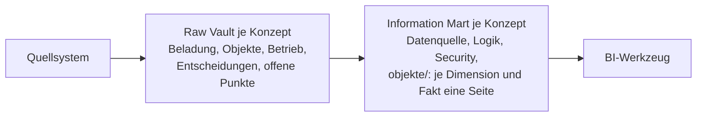

[Dokumentation](../README.md)

# Mandanten-Architektur & Projekt

Alles, was nur für dieses Projekt gilt. Die Handbücher [Benutzer](../01-benutzer/00-benutzerhandbuch.md), [Entwickler](../02-entwickler/00-entwicklerhandbuch.md) und [System](../03-system/00-systemdokumentation.md) bleiben mandantenneutral. Tabellarische Übersicht: [Architektur (Base)](00-mandant-architektur.base).

> [!TIP]
> Ordner beim Projektstart umbenennen in `04-<kunde>-architektur`, und zwar in Obsidian (Rechtsklick → Umbenennen), dann werden alle Links angepasst. Titel und Aliase dieser Notiz sowie `design/vault-sync.json` entsprechend setzen.

## Aufbau

Jedes fachliche Konzept (`mart_<konzept>`) ist zweimal beschrieben: im Information Mart aus Sicht der Nutzer, im Raw Vault aus Sicht der Beladung. Struktur und Regeln: Skill `dv-concept-docs`, Vorlagen in [`vorlagen/`](../vorlagen/).

## Information Marts

| Konzept | Schema | Inhalt | Doku |
|---------|--------|--------|------|
| *(Konzept eintragen, Link auf `information-mart/mart_<konzept>/00-mart-<konzept>.md`)* | `mart_<konzept>` | | offen |

Übersicht: [Information Marts](information-mart/00-information-mart.md)

## Raw Vault

| Konzept | Schemas | Quellen | Doku |
|---------|---------|---------|------|
| *(Konzept eintragen, Link auf `raw-vault/mart_<konzept>/00-mart-<konzept>.md`)* | `vault` | | offen |

Übersicht und Quellen: [Raw Vault](raw-vault/00-raw-vault.md)

## Business Vault

[Business Vault](business-vault/00-business-vault.md): Current Views, PIT, fachliche Regeln.

## Projekt

| Dokument | Inhalt |
|----------|--------|
| [Projektdokumentation](projektdokumentation/00-projektdokumentation.md) | Ziel, Phasen, Stand, offene Punkte, Entscheidungslogbuch |
| `business-case.md` | fachlicher Nutzen (anlegen) |
| `meetings/` | Protokolle `JJJJ-MM-TT-<thema>.md` (anlegen) |
| `assets/` | Architekturdiagramm, PDFs |

## Umgebung

| Was | Wert |
|-----|------|
| SQL Server | `<sql-server>.database.windows.net` |
| Datenbanken | `<datenbank>-dev`, `<datenbank>-test`, `<datenbank>` |
| dbt-Targets | `<mandant>-dev`, `<mandant>-test`, `<mandant>` |
| Storage / Landing Zone | `<storage-account>` / Container `<container>` |
| Pipeline | GitHub Actions bzw. GitLab CI, Repository `<org>/<repo>` |
| Entra-Gruppen | `<gruppen-prefix>-<bereich>-ro`, `…-full-ro` |

## Hinweise zur Pflege

- ER-Diagramme entstehen in `design/` (Model First, Skill `dv-design-sync`) und werden mit `python3 scripts/sync_design_to_vault.py` in die Konzeptordner gespiegelt (Konfiguration `design/vault-sync.json`, je Konzeptordner eine Gruppe). Die `er-*.md`-Notizen nie von Hand ändern.
- Jedes Kapitel einer Konzept- oder Objektseite bleibt stehen. Fehlt Inhalt: „nicht vorhanden“ (gibt es nicht) oder `> [!todo] Noch nicht dokumentiert` (gibt es, ist nicht beschrieben).
